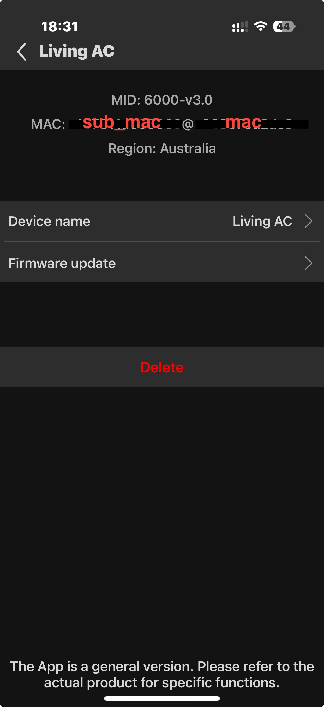

# SmartThings Gree Air Conditioner Driver

A Samsung SmartThings Edge driver for Gree air conditioners using the ME31-00/C7 WiFi dongle module.

## Features
- **Local control** without cloud dependencies
- **Auto-discovery** of Gree AC units on local network  
- **Auto-configuration** - IP, MAC, and encryption key detected automatically
- **Multi-split support** - Control multiple AC units independently
- **Version 1.0**: Basic ON/OFF control with Mode and Temperature display

## Supported Devices
- Gree air conditioners with ME31-00/C7 WiFi module
- Single and multi-split systems
- Tested with various Gree models

## Installation

### Via SmartThings App (Recommended)
1. Enroll in driver channel: [Channel Invitation Link]
2. In SmartThings app: **Devices** → **+** → **Scan nearby**
3. Driver will auto-discover Gree AC units
4. For multi-split systems, configure sub-unit MAC (see below)

### Manual Installation (Developers)
1. Clone repository
2. Package driver: `smartthings edge:drivers:package .`
3. Install via SmartThings CLI

## Multi-Split Configuration

For **multi-split systems** (multiple indoor units), each sub-unit requires manual configuration:

### Finding Sub-Unit MAC Addresses

**Method 1: From Gree+ App**
1. Open Gree+ app
2. Go to device details for each indoor unit
3. Find MAC address in device info (format: `a1b2c3d4000000`)

*The sub-unit MAC address is shown in the device information screen*

**Method 2: From Router DHCP**
1. Access your router's admin page
2. Look for devices named "gree" or similar
3. Note MAC addresses for each indoor unit

**Method 3: From Driver Logs** (requires SmartThings CLI)
1. Run: `smartthings edge:drivers:logcat <driver-id> --hub-address <hub-ip>`
2. Trigger a refresh on the device
3. Look for MAC addresses in response packets

### Setting Sub-Unit MAC
1. In SmartThings app, open device settings
2. Find **"Sub-Unit MAC (Multi-split)"** setting
3. Enter the MAC address for that specific indoor unit (e.g., `a1b2c3d4000000`)
4. Save settings

**Important**: Each sub-unit device needs its own unique sub-unit MAC configured.

## Configuration
Most settings are **auto-configured**:
- ✅ **IP Address**: Detected during discovery
- ✅ **MAC Address**: Detected during discovery  
- ✅ **Encryption Key**: Retrieved automatically via binding

**Manual configuration only needed for**:
- Sub-unit MAC addresses (multi-split systems)
- Adjusting polling interval (optional)
- Temperature display units (optional)

## Version 1.0 Features
- ✅ Power ON/OFF control
- ✅ Display current Mode (Auto, Cool, Dry, Fan, Heat)
- ✅ Display set temperature and current temperature
- ✅ Multi-split system support with individual unit control

## Planned Features (Future Versions)
- Temperature setpoint control
- Mode selection
- Fan speed control
- Advanced features (Quiet mode, Turbo, Swing control)

## Security
⚠️ **Important**: Never commit encryption keys, IP addresses, or MAC addresses to git. All sensitive data is configured via SmartThings device settings and excluded from version control.

## Development
See `IMPLEMENTATION_SUMMARY.md` for comprehensive development guidance and protocol details.

## Protocol Documentation
Based on reverse-engineered Gree WiFi protocol:
- AES-128-ECB encryption
- UDP communication on port 7000
- Multi-split system support
- Protocol references:
  - [Gree HVAC Protocol](https://github.com/tomikaa87/gree-remote)
  - [Gree Protocol Reverse Engineering](https://github.com/bekmansurov/gree-hvac-protocol)
  - [SmartThings LAN Edge Driver Guide](https://developer.smartthings.com/docs/devices/hub-connected/lan/)

## License
[Your License Here]

## Contributing
Contributions welcome! Please ensure no sensitive data (keys, IPs, MACs) is included in pull requests.